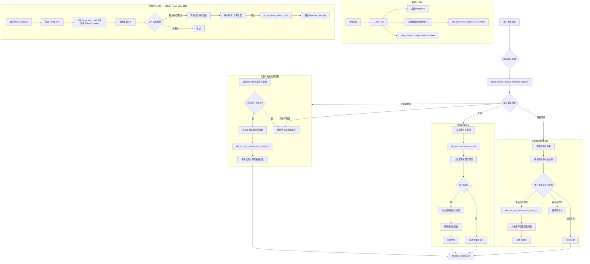
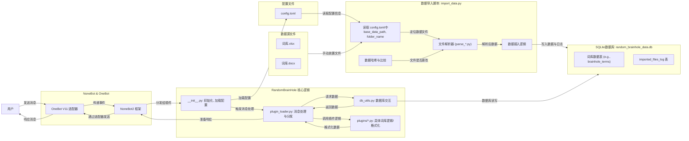

# RandomBrainHole (数据库版)

每个人都可以有自己的随机脑洞！这是一个基于 NoneBot2 和 OneBot V11 协议的插件，允许用户通过配置不同的词库，实现随机获取词条信息、查询特定词条以及使用词库进行随机填词等功能。

## ✨ 功能特性

-   **多词库支持**：通过配置文件 `config.toml` 可以灵活添加和管理多种不同类型的词库（例如：脑洞、拼释、蝠汁牌等）。
-   **数据库存储**：所有词库数据通过 `import_data.py` 脚本导入 SQLite 数据库，提高查询效率和数据管理的便捷性。
-   **随机获取**：用户可以通过发送在 `config.toml` 中为各词库配置的关键词（例如“随机脑洞”）来随机获取一条词条信息。
-   **查词功能**：用户可以使用 `查词 <关键词>` 命令来搜索所有已配置词库中与 `<关键词>` 相关的词条。
-   **随机填词**：用户可以使用 `随机填词 <包含占位符的模板>` 命令，插件会将模板中的 `词库名` 占位符（直接使用 `config.toml` 中定义的 `folder_name`）替换为对应词库中的随机词条。
    -   例如：如果 `folder_name` 分别为 `脑洞词库` 和 `拼释词库`，则发送 `随机填词 今天天气真脑洞词库，心情有点拼释词库。`
    -   如果想在文本中直接使用与 `folder_name` 相同的文字而不被替换，可以在其前面加上反斜杠 `\` 进行转义，例如 `随机填词 我想说的是\脑洞词库本身这个词。`
-   **数据导入脚本**：提供 `import_data.py` 脚本，支持从特定格式的 Excel (.xlsx) 和 Word (.docx) 文件中解析数据并导入数据库。
    -   脚本支持文件哈希检查，避免重复导入未更改的文件。
    -   导入前会进行示例数据展示和用户确认。
-   **灵活配置**：核心行为（如关键词、数据表名、处理函数等）均通过 `config.toml` 进行配置。
-   **日志记录**：集成了 NoneBot 的日志系统，方便追踪插件运行状态和调试。

## 📊 系统图表

### 1. 整体流程图



### 2. 数据流图



## 🚀 环境要求

-   Python >= 3.9
-   NoneBot2 (已安装并能成功运行一个基础的 bot)
-   OneBot V11 适配器 (或您选择的其他兼容适配器，但目前插件元数据指定为 `~onebot.v11`)

## 🛠️ 安装与部署

1.  **准备 NoneBot 环境**：
    确保您已经有一个可以正常运行的 NoneBot2 项目。如果还没有，请参考 [NoneBot2 官方文档](https://v2.nonebot.dev/docs/tutorial/create-project) 进行创建。

2.  **获取插件文件**：
    将 `RandomBrainHole` 文件夹（包含 `__init__.py`, `config.py`, `db_utils.py`, `import_data.py`, `plugin_loader.py` 以及 `plugins` 子文件夹和 `config.toml.example` 文件）放置到您的 NoneBot 项目的插件目录中（通常是 `src/plugins` 或您自定义的插件路径）。

3.  **安装依赖**：
    本插件依赖于一些第三方库来解析数据文件和处理配置。请确保它们已安装：
    ```bash
    pip install nonebot2 nonebot-adapter-onebot pydantic toml pandas openpyxl python-docx
    ```
    -   `nonebot2` 和 `nonebot-adapter-onebot`: NoneBot 核心及适配器。
    -   `pydantic`: 用于数据验证和配置模型。
    -   `toml`: 用于解析 `.toml` 配置文件 (Python 3.11+ 内置 `tomllib`，旧版本可能需要 `toml` 包)。此插件已改为使用 `tomllib`。
    -   `pandas` 和 `openpyxl`: 用于解析 Excel (.xlsx) 文件。
    -   `python-docx`: 用于解析 Word (.docx) 文件。

4.  **配置插件**：
    -   复制 `RandomBrainHole/config.toml.example` 并将其重命名为 `RandomBrainHole/config.toml`。
    -   **仔细阅读并编辑 `config.toml` 文件**，根据您的需求进行配置。详细配置说明见下一章节。

5.  **加载插件**：
    在您的 NoneBot 项目的主入口文件 (通常是 `bot.py`) 中加载此插件。
    ```python
    # bot.py
    import nonebot
    # ... 其他导入 ...

    nonebot.init()
    app = nonebot.get_asgi()

    driver = nonebot.get_driver()
    # ... 其他驱动配置 ...

    # 加载插件，如果你的插件文件夹名为 RandomBrainHole
    nonebot.load_plugin("RandomBrainHole")
    # 或者如果你放在 src.plugins 目录下
    # nonebot.load_plugins("src/plugins") # 这会加载所有插件

    if __name__ == "__main__":
        nonebot.run(app="__mp_main__:app")
    ```

## ⚙️ 配置 (`config.toml`)

`config.toml` 是本插件的核心配置文件。您需要根据自己的词库和需求进行详细配置。

```toml
# config.toml 示例

# (主要供 import_data.py 使用) 词库数据文件的基础路径。
# 请将其修改为您存放原始词库文件 (如 .xlsx, .docx) 的文件夹的绝对或相对路径。
# 如果使用相对路径，它是相对于 RandomBrainHole 插件文件夹的。
# 推荐使用绝对路径以避免混淆。
# 示例: "E:/MyLexicons" 或 "/home/user/my_lexicons"
base_data_path = "your/base/data/path/" # !!!务必修改此路径!!!

# 数据库文件路径。可以是绝对路径，或相对于插件文件夹的路径。
# 如果文件不存在，插件启动时会自动创建。
database_path = "data/random_brainhole_data.db"

# [[plugins]] 代表一个词库插件的配置块。可以有多个这样的块。
[[plugins]]
  # 插件的友好名称，会显示在日志和一些用户消息中。
  name = "脑洞"
  # 对应的 Python 模块名 (在 RandomBrainHole/plugins/ 文件夹下，不含 .py 后缀)。
  module_name = "brainhole"
  # 模块内处理随机信息获取的主函数名。
  info_function_name = "random_brainhole_info"
  # 模块内处理特定词条格式化的函数名 (用于查词功能)。
  format_function_name = "format_brainhole_data"
  # 此插件对应数据库中的表名 (由 import_data.py 创建和使用)。
  table_name = "brainhole_terms"
  # 用于“查词”和“随机填词”时，从此列获取主要词条内容。默认为 "term"。
  search_column_name = "term"
  # 触发此插件随机功能的关键词列表。
  keywords = ["随机脑洞", "来个脑洞", "脑洞时刻"]
  # (供 import_data.py 使用) 存放此类型词库数据文件的文件夹名称 (相对于 base_data_path)。
  # 此名称也用作“随机填词”功能中的占位符。
  folder_name = "脑洞词库" 
  # (供 import_data.py 使用) 支持的文件扩展名列表。
  file_extensions = [".xlsx"]
  # 获取数据失败时的重试次数。
  retry_attempts = 3
  # 最终失败时发送给用户的消息。
  failure_message = "今天的脑洞枯竭了，过会儿再来吧！"

[[plugins]]
  name = "拼释"
  module_name = "pinshi"
  info_function_name = "random_pinshi_info"
  format_function_name = "format_pinshi_data"
  table_name = "pinshi_terms"
  search_column_name = "term" 
  keywords = ["随机拼释", "来个拼释"]
  folder_name = "拼释词库" # 随机填词占位符：拼释词库
  file_extensions = [".xlsx"]
  retry_attempts = 2
  failure_message = "拼释词库今天休息了~"

[[plugins]]
  name = "蝠汁牌"
  module_name = "fuzhipai"
  info_function_name = "random_fuzhipai_info"
  format_function_name = "format_fuzhipai_data"
  table_name = "fuzhipai_cards"
  search_column_name = "full_text" 
  keywords = ["随机蝠汁牌", "抽一张蝠汁牌"]
  folder_name = "蝠汁牌库" # 随机填词占位符：蝠汁牌库
  file_extensions = [".docx"]
  retry_attempts = 2
  failure_message = "找不到蝠汁牌了，它们可能飞走了！"

# ... 可以继续添加更多 [[plugins]] 配置块 ...
```

**关键配置项说明**：

-   `base_data_path`: **极其重要**，用于 `import_data.py` 脚本查找原始数据文件。请务必修改为实际路径。
-   `database_path`: SQLite 数据库文件的存放位置。
-   `plugins` 列表:
    -   `name`: 词库的易读名称。
    -   `module_name`: 对应 `RandomBrainHole/plugins/` 目录下的 Python 文件名（不含 `.py`）。您需要为每个词库创建一个这样的模块。
    -   `info_function_name`: 该模块中，当关键词触发时，用于获取并格式化随机词条的异步函数名。函数应接受 `table_name: str` 参数，并返回 `str`。
    -   `format_function_name`: 该模块中，用于格式化从数据库查询到的单条词条数据的异步函数名（主要为“查词”功能服务）。函数应接受一个包含词条数据的字典 `word_info: Dict[str, Any]` 和一个布尔值 `is_search_result: bool`，并返回 `str`。
    -   `table_name`: 此词库数据在 SQLite 数据库中对应的表名。
    -   `search_column_name`: 当使用“查词”功能时，主要在此列中搜索用户提供的关键词。当使用“随机填词”时，从此列获取要填入的词条。
    -   `keywords`: 用户发送包含这些词的消息时，会触发对应词库的随机词条功能。
    -   `folder_name`: `import_data.py` 会在 `base_data_path` 下的这个子文件夹中查找原始数据文件。**此名称也用作“随机填词”功能中的占位符（例如 `folder_name`），使用 `\folder_name` 进行转义**。
    -   `file_extensions`: `import_data.py` 会查找这些扩展名的文件。
    -   `retry_attempts`, `failure_message`: 随机获取功能失败时的重试和提示。

## 💾 数据导入 (`import_data.py`)

在配置好 `config.toml`（特别是 `base_data_path` 和各个 `plugins` 的 `folder_name` 及 `file_extensions`）之后，您需要运行 `import_data.py` 脚本来将原始数据文件导入到 SQLite 数据库中。

1.  **准备数据文件**：
    根据您在 `config.toml` 中为每个插件配置的 `folder_name`，在 `base_data_path` 指定的目录下创建相应的子文件夹，并将对应类型的词库源文件（例如 `.xlsx`, `.docx`）放入其中。
    -   **文件格式要求**：`import_data.py` 内的各个 `parse_...` 函数针对特定格式的 Excel/Word 文件编写。您可能需要根据您数据文件的实际结构调整这些解析函数。**请务必查看 `import_data.py` 中各解析函数的说明和实现，确保您的数据文件格式与之兼容，或者修改解析函数以适应您的格式。**

2.  **运行导入脚本**：
    在您的项目根目录下（或者能够正确解析 `RandomBrainHole` 包内模块的环境下），通过命令行运行：
    ```bash
    python -m RandomBrainHole.import_data
    ```
    或者，如果您的 Python 环境配置允许直接运行：
    ```bash
    python path/to/your/nonebot_project/src/plugins/RandomBrainHole/import_data.py
    ```
    脚本会：
    -   读取 `config.toml` 配置。
    -   连接（或创建）数据库。
    -   创建数据表（如果尚不存在）。
    -   遍历每个配置的插件，扫描其数据文件夹中的文件。
    -   对每个找到的文件进行哈希检查：
        -   如果文件未改变（与上次导入的哈希值相同），则跳过。
        -   如果是新文件或已更改的文件，则调用相应的解析函数。
    -   解析函数会显示示例数据并请求用户确认是否导入。
    -   确认后，数据将被插入到对应的数据库表中。
    -   导入过程和结果会输出到控制台。

**注意**：首次导入或数据文件结构复杂时，建议先用少量数据测试导入脚本和解析逻辑是否按预期工作。

## 🤖 使用方法

一旦插件正确安装、配置完毕，并且数据已通过 `import_data.py` 导入数据库，机器人启动后即可响应以下命令：

1.  **随机获取词条**：
    发送 `config.toml` 中为某个词库配置的 `keywords` 之一。
    例如，如果脑洞词库的关键词是 `["随机脑洞", "来个脑洞"]`，发送“随机脑洞”即可。
    机器人会从对应的数据库表中随机选择一条记录，并使用该词库模块内 `info_function_name` 指定的函数格式化后发送。

2.  **查询词条**：
    发送 `查词 <你要搜索的词>`
    例如：`查词 某个特定词条`
    插件会在所有已配置词库的 `search_column_name` 列中搜索 `<你要搜索的词>`。如果找到，会使用各词库模块内 `format_function_name` 指定的函数格式化后发送结果。

3.  **随机填词**：
    发送 `随机填词 <包含占位符的模板文本>`
    占位符的格式为 `词库名` (直接使用 `config.toml` 中 `folder_name` 的值)。如果想在文本中原样输出词库名，请在其前加反斜杠 `\` 转义。
    例如：
    -   `config.toml` 中有：
        ```toml
        [[plugins]]
          name = "趣味脑洞"
          folder_name = "趣味脑洞占位符" 
          search_column_name = "term"
          # ... 其他配置 ...
        [[plugins]]
          name = "心情短语"
          folder_name = "心情占位符" 
          search_column_name = "phrase"
          # ... 其他配置 ...
        ```
    -   用户发送：`随机填词 我今天想到了一个趣味脑洞占位符，感觉像是心情占位符！`
    -   插件会从“趣味脑洞”词库的 `term` 列随机取一个词替换 `趣味脑洞占位符`，从“心情短语”词库的 `phrase` 列随机取一个词替换 `心情占位符`。
    -   用户发送：`随机填词 我想描述的是\趣味脑洞占位符这个概念。`
    -   插件会输出：`我想描述的是趣味脑洞占位符这个概念。`

## 🧩 扩展新词库

要添加一个新的词库类型（例如“歇后语”）：

1.  **准备数据源**：
    整理您的歇后语数据，最好是 Excel 或 Word 格式，或者您能用 Python 解析的其他格式。

2.  **创建解析模块 (`plugins/xhy.py`)**：
    在 `RandomBrainHole/plugins/` 目录下创建一个新的 Python 文件，例如 `xhy.py` (歇后语的拼音首字母)。
    在此文件中，您需要实现至少两个异步函数：
    -   `random_xhy_info(table_name: str) -> str`:
        -   功能：从数据库 `table_name` 表中随机获取一条歇后语数据。
        -   调用 `await get_random_entry_from_db(table_name)` 获取数据字典。
        -   调用下面的 `format_xhy_data` 函数格式化数据。
        -   处理获取失败的情况（例如返回 `failure_message` 或抛出 `ValueError`）。
    -   `format_xhy_data(word_info: Dict[str, Any], is_search_result: bool = True) -> str`:
        -   功能：将从数据库获取的单条歇后语数据字典 `word_info` 格式化为用户友好的字符串。
        -   `is_search_result` 参数用于区分是随机获取还是查词结果，可以影响输出的标题。

3.  **更新 `config.toml`**：
    添加一个新的 `[[plugins]]` 配置块：
    ```toml
    [[plugins]]
      name = "歇后语"
      module_name = "xhy" 
      info_function_name = "random_xhy_info" 
      format_function_name = "format_xhy_data" 
      table_name = "xhy_terms" 
      search_column_name = "question" 
      keywords = ["随机歇后语", "来个歇后语"]
      folder_name = "歇后语数据" # 随机填词占位符：歇后语数据
      file_extensions = [".xlsx"] 
      retry_attempts = 2
      failure_message = "今天想不出歇后语啦。"
    ```

4.  **更新数据库结构 (`db_utils.py`)**：
    -   在 `db_utils.py` 中，为新的 `xhy_terms` 表添加一个 `CREATE_XHY_TABLE_SQL` 语句。
        ```python
        CREATE_XHY_TABLE_SQL = """
        CREATE TABLE IF NOT EXISTS xhy_terms (
            id INTEGER PRIMARY KEY AUTOINCREMENT,
            question TEXT NOT NULL, -- 歇后语题目
            answer TEXT NOT NULL,   -- 歇后语答案
            source_file TEXT NOT NULL,
            imported_at TIMESTAMP DEFAULT CURRENT_TIMESTAMP,
            UNIQUE (question, answer, source_file)
        );"""
        ```
    -   将新的表名和 SQL 语句添加到 `ALL_TABLE_SCHEMAS` 字典中：
        ```python
        ALL_TABLE_SCHEMAS = {
            # ... 其他表 ...
            "xhy_terms": CREATE_XHY_TABLE_SQL,
        }
        ```

5.  **更新数据导入脚本 (`import_data.py`)**：
    -   在 `import_data.py` 中，添加一个新的解析函数 `parse_xhy_excel(file_path: Path, source_file_name: str) -> Iterator[Dict[str, Any]]`。这个函数需要能正确解析您的歇后语数据文件，并 `yield` 出包含 `question` 和 `answer` 等字段的字典。
    -   在 `main()` 函数的 `parser_map` 字典中添加新的映射：
        ```python
        parser_map = {
            # ... 其他映射 ...
            "歇后语": {"parser": parse_xhy_excel, "table": "xhy_terms"},
        }
        ```

6.  **重新运行数据导入脚本**：
    将您的歇后语数据文件放到 `base_data_path/歇后语数据/` 目录下，然后运行 `python -m RandomBrainHole.import_data`。

7.  **重启机器人**：
    使新的配置和代码生效。

## 📜 许可证

MIT License @ Dax233 (原作者) 及后续贡献者。
