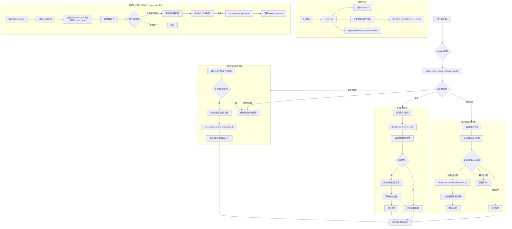

# RandomBrainHole

> “每个人都可以有自己的随机脑洞” —— 一个插件化、可扩展、定位为“脑洞生成器”的 NoneBot2 Python 插件

---

## 项目简介

RandomBrainHole 是一个基于 NoneBot2 的插件，旨在成为一个支持插件化扩展的“脑洞”记录、生成与分享平台。您可以自由扩展词库插件，记录、生成、分享各种天马行空的想法。本项目支持从特定格式文件导入数据到 SQLite 数据库，并通过配置驱动不同词库的随机获取、查询和填词等功能。

## 主要特性

-   **插件化词库**：通过简单的配置和代码扩展，可以方便地添加新的词库类型和对应的处理逻辑。
-   **数据库存储**：使用 SQLite 存储所有词库数据，通过 `import_data.py` 脚本进行数据导入和管理。
-   **多功能交互**：
    -   **随机获取**：通过关键词触发，随机获取指定词库的词条。
    -   **查词功能**：允许用户查询所有已配置词库中的特定词条。
    -   **随机填词**：用户可以提供包含占位符的模板，插件会用相应词库的随机词条替换占位符。
-   **灵活配置**：通过 `config.toml` 文件集中管理插件行为、词库关键词、数据库表名、处理函数等。
-   **数据导入与校验**：`import_data.py` 支持从 Excel (.xlsx) 和 Word (.docx) 文件导入数据，并进行文件哈希校验以避免重复导入。
-   **清晰的日志记录**：集成 NoneBot 日志系统，方便追踪和调试。

## 📊 系统图表

### 1. 整体流程图



### 2. 数据流图

```mermaid
graph LR
    U[用户]

    subgraph DataSource ["数据源文件"]
        direction TB
        Excel["词库.xlsx"]
        Word["词库.docx"]
    end

    subgraph ImportProcess ["导入脚本 (import_data.py)"]
        direction TB
        IP1["读取配置 (base_data_path, folder_name)"]
        IP2["文件解析器 (parse_*.py)"]
        IP3["数据哈希与比较"]
        IP4["数据插入逻辑"]
    end

    subgraph ConfigFiles ["配置文件"]
        direction TB
        CFG["config.toml"]
    end

    subgraph Database ["数据库 (SQLite)"]
        direction TB
        DB_Tables["词库表 (e.g., brainhole_terms)"]
        DB_Log["日志表 (imported_files_log)"]
        DB_Name["(random_brainhole_data.db)"]
        style DB_Name fill:#fff,stroke:#fff,color:#555,fontSize:10px
    end

    subgraph PluginCore ["核心逻辑 (RandomBrainHole)"]
        direction TB
        PC_Init["初始化 (__init__.py)"]
        PC_Loader["消息处理 (plugin_loader.py)"]
        PC_DBUtils["数据库交互 (db_utils.py)"]
        PC_Plugins["具体词库 (plugins/*.py)"]
    end

    subgraph BotPlatform ["Bot平台"]
        direction TB
        NB["NoneBot2 框架"]
        OB["OneBot V11 适配器"]
    end

    DataSource -->|"手动放置文件"| IP1
    CFG -->|"读取配置信息"| IP1
    IP1 -->|"定位数据文件"| IP2
    IP2 -->|"解析后数据"| IP4
    IP3 -->|"文件是否更改"| IP2
    IP4 -->|"写入数据与日志"| Database

    U -- "发送消息" --> OB
    OB -- "传递事件" --> NB
    NB -- "分发给插件" --> PC_Init
    PC_Init -- "加载配置" --> CFG
    PC_Init -- "触发消息处理" --> PC_Loader
    PC_Loader -- "请求数据" --> PC_DBUtils
    PC_DBUtils -- "数据库读写" --> Database
    PC_DBUtils -- "返回数据" --> PC_Loader
    PC_Loader -- "调用插件逻辑" --> PC_Plugins
    PC_Plugins -- "格式化数据" --> PC_Loader
    PC_Loader -- "准备响应" --> NB
    NB -- "通过适配器发送" --> OB
    OB -- "响应消息" --> U
```



## 快速开始

### 1. 克隆或下载仓库

```bash
git clone [https://github.com/Dax233/RandomBrainHole.git](https://github.com/Dax233/RandomBrainHole.git)
# 或者直接下载 ZIP 包解压
cd RandomBrainHole
```
(如果您的项目不是直接从该地址克隆，请调整此步骤为获取插件文件)

### 2. 放置插件
将 `RandomBrainHole` 文件夹放置到您的 NoneBot 项目的插件目录中（通常是 `your_project/src/plugins/`）。

### 3. 安装依赖
确保您的 NoneBot 环境已安装以下依赖。如果您的项目使用 `requirements.txt` 或 `pyproject.toml` 管理依赖，请将这些添加到其中：
```bash
pip install pydantic toml pandas openpyxl python-docx
# 注意: NoneBot2 和适配器 (如 nonebot-adapter-onebot) 应已作为您Bot项目的基础依赖安装。
# Python 3.11+ 内置 tomllib，旧版本可能需要 toml。本插件使用 tomllib。
```

### 4. 配置环境
   - 复制插件目录下的 `config.toml.example` 并重命名为 `config.toml`。
   - 编辑 `config.toml`，**务必**正确填写 `base_data_path` 指向您的原始词库文件存放的基础路径。
   - 根据您的词库文件和期望功能，配置 `[[plugins]]` 表格中的各项参数（详见下文“配置”部分）。

### 5. 准备数据并导入
   - 根据 `config.toml` 中各 `plugins` 的 `folder_name` 设置，在 `base_data_path` 下创建相应的子文件夹，并将词库源文件（如 `.xlsx`, `.docx`）放入。
   - **检查并调整数据解析逻辑**：`import_data.py` 中的 `parse_*` 函数需要与您的数据文件结构匹配。您可能需要修改这些函数。
   - 在您的项目根目录运行数据导入脚本：
     ```bash
     python -m src.plugins.RandomBrainHole.import_data
     # 或者根据您的项目结构调整路径
     ```
   - 脚本会引导您完成数据导入，包括示例确认。

### 6. 加载插件并运行 Bot
确保您的 NoneBot 项目已配置为加载 `RandomBrainHole` 插件。
例如，在您的 `bot.py` 或主配置文件中：
```python
nonebot.load_plugin("src.plugins.RandomBrainHole") # 根据实际路径调整
```
然后正常启动您的 NoneBot 机器人。

## 目录结构说明 (插件视角)

```text
your_nonebot_project/
├── bot.py                     # (示例) NoneBot 项目入口/Bot主文件
├── pyproject.toml             # (示例) 项目配置文件，含依赖
└── src/
    └── plugins/
        └── RandomBrainHole/       # 插件根目录
            ├── __init__.py        # 插件加载入口 (元数据, 生命周期钩子)
            ├── config.toml.example # 配置文件模板
            ├── config.py          # 配置模型与加载逻辑
            ├── db_utils.py        # 数据库连接、表创建、查询工具
            ├── import_data.py     # 数据导入脚本 (手动运行)
            ├── plugin_loader.py   # 核心消息处理器与插件功能调度
            ├── plugins/           # 各具体词库的处理模块
            │   ├── brainhole.py   # 示例：脑洞词库模块
            │   ├── pinshi.py
            │   └── ...            # 其他词库模块
            └── README.md          # (本文档)
```

## 词库插件开发指南 (扩展新词库)

1.  **创建词库逻辑模块**:
    在 `RandomBrainHole/plugins/` 文件夹下新建一个 Python 文件，例如 `my_new_lexicon.py`。

2.  **实现核心函数**:
    在该模块中，您需要实现至少两个异步函数：
    * `async def random_info(table_name: str) -> str`:
        * 功能：当匹配到此词库的关键词时被调用。
        * 从 `table_name` 指定的数据库表中随机获取一条记录 (可使用 `from ..db_utils import get_random_entry_from_db`)。
        * 调用下面的 `format_data` 函数来格式化这条记录。
        * 处理数据获取失败的情况（例如，如果表为空，可以返回 `config.toml` 中配置的 `failure_message` 或抛出 `ValueError`）。
    * `async def format_data(word_info: Dict[str, Any], is_search_result: bool = True) -> str`:
        * 功能：将从数据库获取的单条词库数据字典 `word_info` 格式化为用户友好的字符串。
        * `is_search_result` 参数用于区分是随机获取还是查词结果，可以据此调整输出的标题或格式。

3.  **更新数据库结构 (`db_utils.py`)**:
    * 在 `db_utils.py` 中，为您的新词库定义一个 `CREATE_TABLE_SQL` 语句，例如 `CREATE_MYLEXICON_TABLE_SQL`。
    * 将新表名和对应的 SQL 语句添加到 `ALL_TABLE_SCHEMAS` 字典中。

4.  **更新数据导入脚本 (`import_data.py`)**:
    * 添加一个新的数据解析函数，例如 `parse_mynewlexicon_file(file_path: Path, source_file_name: str) -> Iterator[Dict[str, Any]]`。此函数需要能解析您的原始数据文件格式，并 `yield` 出符合新表结构的字典。
    * 在 `import_data.py` 的 `main()` 函数内的 `parser_map` 字典中，添加新词库的映射，将词库的友好名称（将用于 `config.toml`）映射到其解析函数和目标表名。例如：
        ```python
        parser_map = {
            # ... 其他词库 ...
            "我的新词库": {"parser": parse_mynewlexicon_file, "table": "my_lexicon_table_name"},
        }
        ```

5.  **配置新词库 (`config.toml`)**:
    在 `config.toml` 文件中，添加一个新的 `[[plugins]]` 配置块：
    ```toml
    [[plugins]]
      name = "我的新词库" # 对应 parser_map 中的键
      module_name = "my_new_lexicon" # 对应步骤1中创建的文件名 (不含.py)
      info_function_name = "random_info" # 对应步骤2中实现的随机获取函数名
      format_function_name = "format_data" # 对应步骤2中实现的格式化函数名
      table_name = "my_lexicon_table_name" # 对应步骤3中定义的表名
      search_column_name = "primary_field" # 此词库中用于搜索和填词的主要字段名
      keywords = ["随机我的新词库", "来个新词库"]
      folder_name = "我的新词库数据" # import_data.py 使用的文件夹名，也是填词占位符
      file_extensions = [".xlsx"] # 支持的文件扩展名
      retry_attempts = 2
      failure_message = "今天我的新词库也空空如也。"
    ```

6.  **导入数据与测试**:
    * 将您的新词库原始数据文件放到 `base_data_path/我的新词库数据/` 目录下。
    * 重新运行数据导入脚本 (`python -m src.plugins.RandomBrainHole.import_data`)。
    * 重启您的 NoneBot 机器人并测试新词库的功能。

## 数据库结构

本项目默认使用 SQLite 数据库。主要的表结构在 `db_utils.py` 中的 `CREATE_..._TABLE_SQL` 常量中定义。

核心表包括：
-   **词库数据表**: 例如 `brainhole_terms`, `pinshi_terms`, `fuzhipai_cards`, `suilan_terms`, `wuxing_terms`, `yuanxiao_terms`, `zhenxiu_terms` 等。这些表的具体列结构取决于对应词库的数据特性，通常在 `db_utils.py` 中定义，并在 `import_data.py` 的解析函数中体现。
-   `imported_files_log`: 用于记录已导入的数据文件及其哈希值，以避免重复导入。包含字段如 `file_identifier`, `file_hash`, `last_imported_at`, `status`, `plugin_type`。

详细的表结构（列名、类型、约束）可以直接查看 `db_utils.py` 文件中的 `CREATE TABLE` SQL语句。

## 参与贡献

欢迎提交 issue、PR，也欢迎自定义你的“脑洞”插件！

1. Fork 本仓库 (如果项目已在 GitHub 等平台开源)
2. 新建分支开发你的功能 (例如：`git checkout -b feature/my-awesome-lexicon`)
3. 提交你的更改 (例如：`git commit -m 'Add: My awesome lexicon plugin'`)
4. 推送到你的分支 (例如：`git push origin feature/my-awesome-lexicon`)
5. 创建一个新的 Pull Request

## License

本项目采用 MIT License。

---

> 有问题请直接提 Issue 或 PR，欢迎一起“脑洞大开”！
